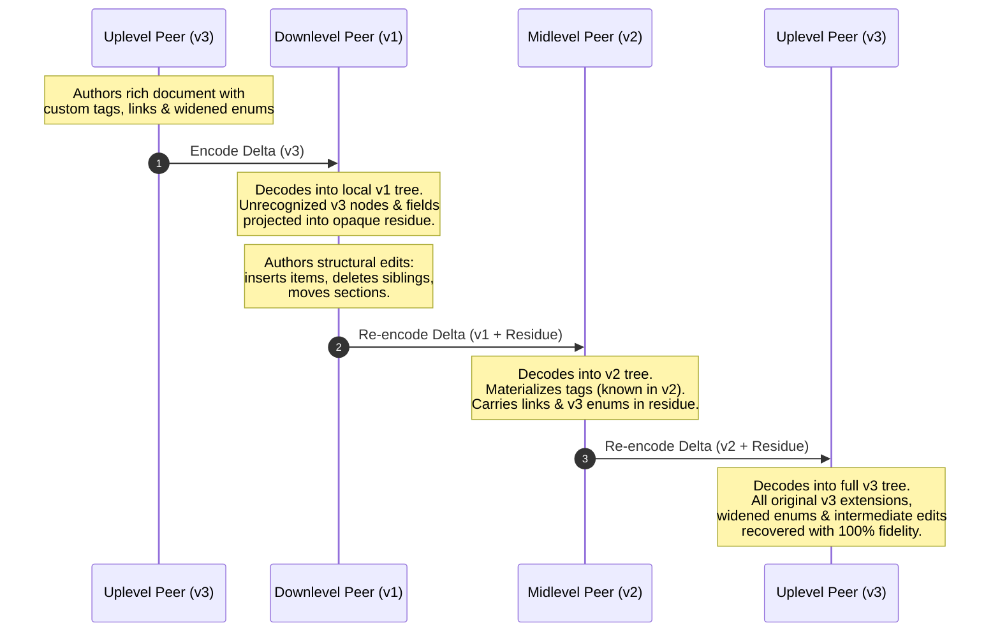
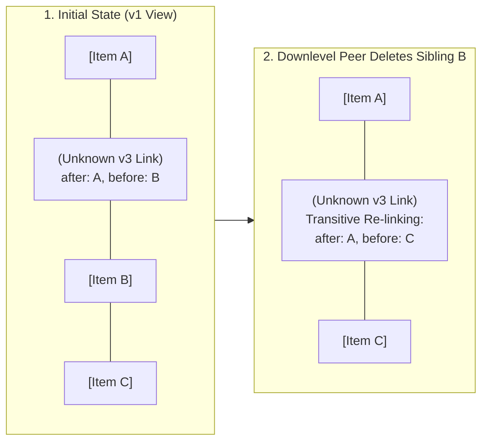
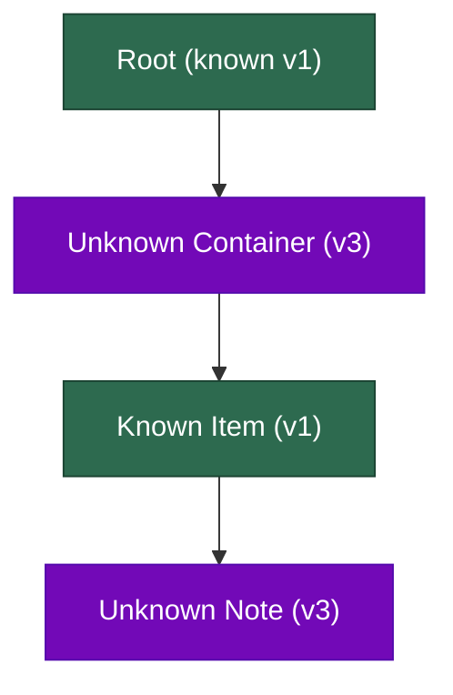

# Rebase-Safe Codec

[](https://nodejs.org/)
[](package.json)
[](tests/)
[](PROTOCOL.md)
[](LICENSE.md)

> **A schema-agnostic, multi-hop incremental delta synchronization engine for hierarchical documents and collaborative distributed state.**

---

## 📌 Overview

In modern local-first and collaborative applications (e.g., Notion, Figma, Google Docs, CRDT-based document stores), clients and servers frequently operate with **version skew**. A downlevel client running schema version $v1$ must collaborate seamlessly with an uplevel client running schema version $v3$ without dropping unparseable data or corrupting document topology.

`rebase-safe-codec` is a high-performance, zero-dependency synchronization engine designed to solve the **schema-evolution delta rebase problem**. It enables peers to author local edits, encode compact binary deltas, and forward updates through multi-hop relay chains of heterogeneous schema versions ($v3 \to v1 \to v2 \to v1 \to v3$) while mathematically guaranteeing:

1. **Lossless Preservation**: Unrecognized node types, fields, and widened enum variants are carried across intermediate downlevel edits without data loss.
2. **Topological Invariance**: Preserved items retain stable relative positioning among siblings even when downlevel peers insert, delete, reorder, or permute neighboring nodes.
3. **Non-Resurrection**: Deletion of a parent node by a downlevel peer permanently purges all unknown descendant subtrees and fields.
4. **AST Compaction**: Mutation streams are canonically compacted to eliminate transient allocations, duplicate field writes, and redundant moves within calibrated wire size bounds.

---

## 🔄 Multi-Hop Relay Architecture



---

## ⚡ Core Algorithmic Innovations

### 1. Dual-Anchor Relative Coordinate Space
Standard array indexing (`index: 3`) breaks as soon as concurrent peers insert or delete siblings. Single-anchor pointers (`afterId` or `beforeId` alone) invert or lose orientation during sibling swaps, reversals, and multi-node cascading deletions.

`rebase-safe-codec` uses a **dual-anchor coordinate model**:
$$\text{Anchor} = \{ \text{parentId}, \text{afterId}, \text{beforeId} \}$$



- **Transitive Anchor Splicing**: When neighboring siblings are deleted or moved, anchor pointers transitively splice across deleted spans to the nearest surviving boundary siblings.
- **Span Stability**: Multi-node sequences of preserved items maintain their internal order and bounded boundaries across arbitrary downlevel permutations.

---

### 2. Multi-Pass AST Net-Diff Compaction State Machine
Raw client mutation streams often contain high intermediate churn (e.g., rapid text typing, transient scratch nodes, repeated property modifications). 

The compaction engine executes an in-memory topological reduction:
- **Duplicate Overwrite Coalescing**: Consecutive `setField` mutations on the same node are reduced to their final value.
- **Transient Node Elimination**: If a node is inserted and subsequently deleted within the same batch, all operations relating to it and its descendants are pruned from the wire delta.
- **Redundant Move Folding**: Successive relocations of a node collapse to a single move to the final parent and index.

---

### 3. Recursive Arbitrary-Depth Subtree Projection
Unrecognized nodes may contain nested hierarchies 4+ tiers deep with alternating known and unknown child structures (e.g., a known `item` inside an unknown `section` inside an unknown `container`).



- **Recursive Extraction**: The encoder recursively projects unknown subtrees into opaque blobs within `residue.nodes`, while preserving unknown field properties in `residue.fields`.
- **Cascading Invalidation**: Deleting an ancestor node immediately purges all descendant residue, eliminating ghost resurrection bugs upon subsequent uplevel decoding.

---

### 4. Calibrated Wire Efficiency & Mathematical Bounds
The wire protocol satisfies a strict per-delta size bound for deltas encoded from a clean baseline:

$$\text{bytes} \le \lfloor 2.4 \times (\text{net content bytes}) + 48 \times (\text{net touched node count}) + 128 \rfloor$$

Where:
- $\text{net content bytes}$ is the serialized payload length of canonical net operations.
- $\text{net touched node count}$ is the unique cardinality of touched node identifiers.

---

## 🚀 Quickstart & API Reference

### Installation
The codec is plain ESM JavaScript targeting Node.js 20+ with **zero external runtime dependencies**.

```javascript
import { encode, decode } from "./src/index.js";
```

### 1. `encode(baseline, mutations, version)`
Serializes an ordered list of authored mutations against a shared baseline into a compact wire payload.

```javascript
const baseline = { tree: currentTree, residue: currentResidue };
const mutations = [
  { op: "insert", parentId: "root", index: 0, node: { id: "item_1", type: "item", fields: { label: "Task 1" }, children: [] } },
  { op: "setField", nodeId: "item_1", field: "priority", value: "high" }
];

// Encodes a compact binary payload (Uint8Array)
const deltaBytes = encode(baseline, mutations, /* version */ 1);
```

### 2. `decode(baseline, bytes, version)`
Applies incoming wire bytes onto a local baseline, materializing known structures into `tree` and preserving unparseable content in `residue`.

```javascript
const { tree, residue } = decode(baseline, deltaBytes, /* version */ 1);

console.log("Materialized Tree:", tree);
console.log("Preserved Residue:", residue);
```

---

## 🧪 Comprehensive Verification Suite

The repository includes a deterministic, seeded test generator ([`tests/generator.mjs`](tests/generator.mjs)) and an isolated verification runner ([`tests/runner.mjs`](tests/runner.mjs)) executing **375 held-out scenarios across 12 topological families**:

| Family | Scenarios | Focus Area | Key Invariant Tested |
| :--- | :---: | :--- | :--- |
| **F1** | 45 | Insert Relocation | Insertions around preserved anchors maintain tie-break precedence |
| **F2** | 35 | Cross-Subtree Moves | Preserved nodes follow moved parents across boundary subtrees |
| **F3a** | 20 | Delete Ahead | Deleting preceding siblings maintains correct anchor indices |
| **F3b** | 20 | Delete Anchor | Deleting immediate anchor sibling shifts coordinate to adjacent neighbor |
| **F3c** | 15 | Multi-Anchor Collapse | Cascading multi-node deletions resolve transitively to surviving boundaries |
| **F4** | 25 | Non-Resurrection | Deleting ancestor node permanently purges all descendant residue |
| **F5** | 25 | Unknown-Bearing Subtree | Moving subtrees with internal residue relocates all attached metadata |
| **F6** | 60 | 3- to 6-Hop Asymmetric Relays | Asymmetric multi-peer transit ($v3 \leftrightarrow v1 \leftrightarrow v2$) preserves full fidelity |
| **F7** | 20 | Bound-Tight Size Bounds | Compact framing efficiency under heavy structural mutations |
| **F8** | 25 | Sibling Permutations | Multi-node sibling swaps and reversals maintain intra-span stability |
| **F9** | 25 | Compaction Churn | Net-diff compaction collapses intermediate overwrites and transient nodes |
| **F10** | 15 | Deep 4-Tier Subtrees | Deeply nested hierarchies with alternating known/unknown node levels |
| **F11** | 20 | Widened Enum Transits | Preserves unparseable enum variants across multi-version transit |
| **F12** | 20 | Transitive Anchor Chains | Chains of adjacent unknown nodes preserve intra-sequence relative order |

### Running Tests

```bash
# Run 375 held-out verification suite on primary reference (Codec A)
npm test

# Run 375 held-out verification suite on alternative engine (Codec B)
npm run test:alt

# Run visible regression scenario suite
npm run test:visible

# Run end-to-end Python/Pytest verifier harness
make verify
```

---

## 📊 Discrimination & Comparative Architecture Matrix

To validate that verification tests measure fundamental synchronization correctness rather than arbitrary formatting, multiple conforming and non-conforming architectures were benchmarked against the 375-scenario suite:

| Architecture | Visible (25) | Held-Out (375) | Size Check | Failure Mechanism |
| :--- | :---: | :---: | :---: | :--- |
| **Reference (Codec A: String Tuples)** | **25/25** | **375/375** | **Pass (56.7% avg / 38.3% min headroom)** | Conforming reference implementation |
| **Alternate (Codec B: Integer Opcodes)** | **25/25** | **375/375** | **Pass (57.3% avg / 39.1% min headroom)** | Conforming flat-array residue implementation |
| **Full-String Opcodes (`["insert", ...]`)** | **25/25** | **375/375** | **Pass (53.6% avg / 35.8% min headroom)** | Conforming string opcode implementation |
| **Standard JSON Object (`{op:"insert",...}`)**| **25/25** | **375/375** | **Pass (30.3% avg / 9.2% min headroom)** | Conforming object-keyed implementation |
| *Naive Uncompacted Churn* | 10/25 | 32/375 | **Fail (100% rejected)** | Exceeds wire size bounds on mutation churn |
| *Whole-State Resend* | 17/25 | 172/375 | **Fail (100% rejected)** | Wire size scales with $O(\text{Tree Size})$ instead of $O(\Delta)$ |
| *Offset-Anchored Indexing* | 21/25 | 210/375 | Fail | Sibling index shift causes displaced or lost nodes |
| *TLV / Flat Protobuf Passthrough* | 17/25 | 195/375 | Fail | Loss of relative sibling coordinates on local edit |
| *Drop-Unknowns Passthrough* | 11/25 | 51/375 | Fail | Outright data loss of unparseable extensions |

---

## 📂 Repository Layout

```text
rebase-safe-codec/
├── src/                      # Production codec source code
│   ├── index.js              # Primary Reference Engine (Codec A: dual-anchor, tuple framing)
│   ├── codec-alt.js          # Alternative Engine (Codec B: flat residue, integer opcodes)
│   ├── measure.js            # Size bound computation utility
│   └── model/                # AST node models, schema versions (v1, v2, v3), mutators
├── docs/                     # Specifications & architecture documentation
│   ├── PROTOCOL.md           # Formal wire protocol specification & contract
│   └── architecture.md       # In-depth architectural design & mathematical proofs
├── tests/                    # Comprehensive verification suite
│   ├── scenarios/            # 25 visible scenario fixtures
│   ├── generator.mjs         # Seeded generator for 375 held-out scenarios (F1–F12)
│   ├── runner.mjs            # Isolated RPC child worker test harness
│   ├── agent-worker.mjs      # Isolated V8 subprocess worker
│   ├── run_scenarios.js      # Local test runner & diff visualizer
│   ├── test_state.py         # Pytest verification suite (19 test gates)
│   └── adversarial/          # Adversarial security and fuzzing suite
├── package.json              # Node.js project manifest & test scripts
├── pyproject.toml            # Python packaging & pytest configuration
├── Makefile                  # Build & verification automation
└── README.md                 # Project documentation
```

---

## 📄 License

This project is licensed under the **MIT License** — see the [LICENSE.md](LICENSE.md) file for details.
