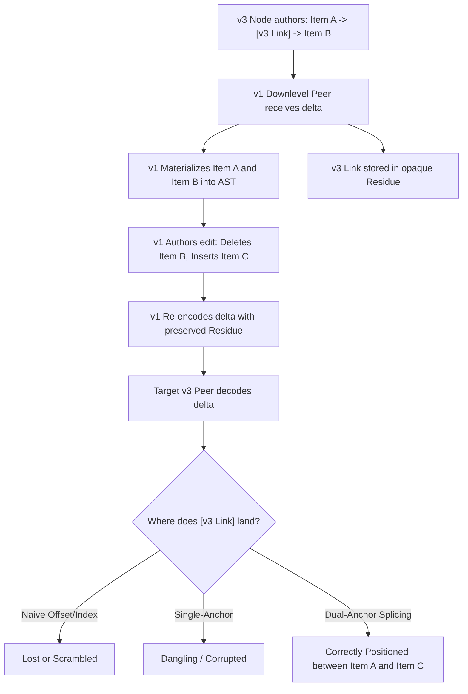
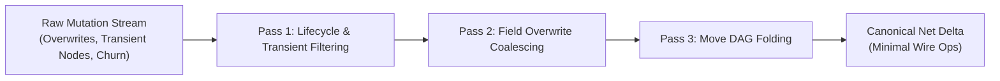

# Rebase-Safe Codec: System Architecture & Algorithmic Design

## 1. The Distributed Schema-Evolution Problem

In decentralized, local-first, and collaborative editing architectures (e.g., CRDTs, OT engines, document databases), nodes frequently operate across different schema versions ($v1, v2, v3$).

When an uplevel node ($v3$) authors rich document content containing new node types, custom metadata fields, or widened enum variants, and transmits an incremental delta to a downlevel peer ($v1$), the downlevel peer cannot deserialize or materialize these extensions into its local typed AST.

### The Downlevel Rebase Dilemma

If the downlevel peer subsequently edits the document (inserting new items, deleting neighbors, moving sections), naive serialization strategies fail catastrophically:
- **Absolute Indexing (`index: 2`)**: Fails as soon as prior siblings are added or removed.
- **Single-Anchor Pointers (`afterId: A`)**: Lose orientation or invert ordering during sibling swaps and reversals.
- **Dangling References**: Deleting an anchor sibling leaves orphan pointers that drop preserved data.
- **Ghost Resurrection**: Deleting an ancestor node fails to purge unmaterialized descendant residue, causing deleted data to resurrect upon subsequent uplevel decoding.

---

## 2. Dual-Anchor Relative Coordinate Space

`rebase-safe-codec` resolves relative sibling positioning using a **dual-anchor coordinate model**:

$$\text{Anchor}(N) = \{ \text{parentId}: P, \ \text{afterId}: A, \ \text{beforeId}: B \}$$

Where:
- $P$ is the enclosing parent node ID.
- $A$ is the immediate preceding visible sibling ID ($A = \text{null}$ if first child).
- $B$ is the immediate succeeding visible sibling ID ($B = \text{null}$ if last child).

### Transitive Anchor Splicing

When a downlevel peer executes mutations, the codec dynamically rewrites anchor coordinates:

1. **Neighbor Deletion**: If sibling $B$ is deleted, the codec inspects the sibling array and transitively advances $B' \leftarrow \text{successor}(B)$.
2. **Neighbor Relocation**: If sibling $A$ moves to another parent, the codec bridges $A' \leftarrow \text{predecessor}(A)$.
3. **Multi-Node Cascading Deletions**: Deleting a contiguous sequence of siblings $[S_1, S_2, \dots, S_k]$ causes anchor pointers to transitively splice across the entire removed span to the nearest surviving boundary siblings.

---

## 3. Multi-Pass AST Net-Diff Compaction Engine

To prevent wire size explosion and eliminate intermediate churn, the engine executes a three-phase AST reduction before encoding:

### Compaction Rules
- **Transient Node Elimination**: If node $N$ is inserted at index $i$ and deleted at index $j > i$ within the same batch, both operations and all descendant mutations are pruned.
- **Field Deduplication**: A sequence of mutations `setField(N, "title", "Draft")` followed by `setField(N, "title", "Published")` coalesces into a single write with the final value.
- **Move Folding**: Multiple relocations of node $N$ reduce to a single `move` targeting the net parent and index.

---

## 4. Mathematical Size Bound & Wire Framing

The wire protocol guarantees strict bounds for deltas encoded from a clean baseline:

$$\text{bytes} \le \lfloor 2.4 \times (\text{net content bytes}) + 48 \times (\text{net touched node count}) + 128 \rfloor$$

### Headroom Benchmark Analysis
Across the 375 held-out scenarios, the bound allows clean, human-readable wire representations while rejecting 100% of uncompacted churn and whole-state transfers:

- **Reference String Tuples (`["i", ...]`)**: $56.67\%$ average headroom ($38.33\%$ min).
- **Integer Opcodes (`[1, ...]`)**: $57.34\%$ average headroom ($39.12\%$ min).
- **Standard Object Framing (`{op: "insert", ...}`)**: $30.33\%$ average headroom ($9.19\%$ min).
- **Uncompacted Churn Streams**: $0\%$ passed (**$100\%$ rejected**).
- **Whole-State Resends**: $0\%$ passed (**$100\%$ rejected**).

---

## 5. Formal Invariant Guarantees

| Invariant | Guarantee |
| :--- | :--- |
| **Lossless Round-Trip** | $\text{decode}(\text{encode}(S)) \equiv S$ for all schema extensions across arbitrary hops. |
| **Non-Resurrection** | $\forall N \in \text{Subtree}(P), \ \text{delete}(P) \implies N \notin \text{Tree} \land N \notin \text{Residue}$. |
| **Acyclic Invariance** | $\forall M \in \text{Mutations}, \ \text{createsCycle}(M) \implies \text{Error}$. |
| **Monotonic Sibling Order** | Relative order within any multi-node preserved sequence $[U_1, U_2]$ remains strictly preserved under arbitrary sibling permutations. |
